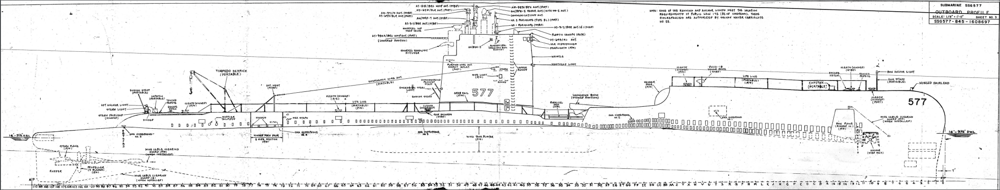

# Technical Drawings
Historical Engineering and Technical Drawings Resources

What is included:
- Historical documents with measured drawings

What is not included:
- Drawings made by/for hobby recreations and art
- Collections without scale/measurements

## U.S. Library of Congress
Historic American Buildings Survey/Historic American Engineering Record/Historic American Landscapes Survey
https://www.loc.gov/pictures/collection/hh/

- Search for collections with "Measured Drawing(s)"
- Download TIFF for high resolution version

Example: [Texas State Capitol](https://www.loc.gov/pictures/search/?q=Drawing:%20tx0398&fi=number&op=PHRASE&va=exact&co%20=hh&st=gallery&sg%20=%20true)

## U.S. National Archives

Series of Ship Engineering Drawings:
https://catalog.archives.gov/search-within/559623?availableOnline=true&typeOfMaterials=Architectural%20and%20Engineering%20Drawings

Example: [Plans for the Armored Cruiser USS Maine](https://catalog.archives.gov/id/53484484)

## Denver Public Library Digital Collections
https://digital.denverlibrary.org/digital/search/order/datea/ad/asc/page/1

Example: [Denver & Rio Grande Railway Drawings](https://digital.denverlibrary.org/digital/collection/p16079coll29/search/searchterm/Denver%20and%20Rio%20Grande%20Railway%20Company./field/creato/mode/exact/conn/and)

## San Francisco Maritime National Park Association

Booklet of General Plans Online:
https://maritime.org/doc/plans/index.php

Example: [USS Growler Submarine SSG577 Booklet of General Plans](https://maritime.org/doc/plans/ssg577.pdf)

## Misc
- [Derby Carriage and Wagon Works](https://collection.sciencemuseumgroup.org.uk/documents/aa110002829/engineering-drawings-from-the-derby-carriage-and-wagon-works)

## Canada National Archives
Architectural and technical drawings:
https://recherche-collection-search.bac-lac.gc.ca/eng/Home/Search?DataSource=Archives&num=25&start=0&enviro=prod&TypeOfMaterialCode=700&OnlineCode=1
