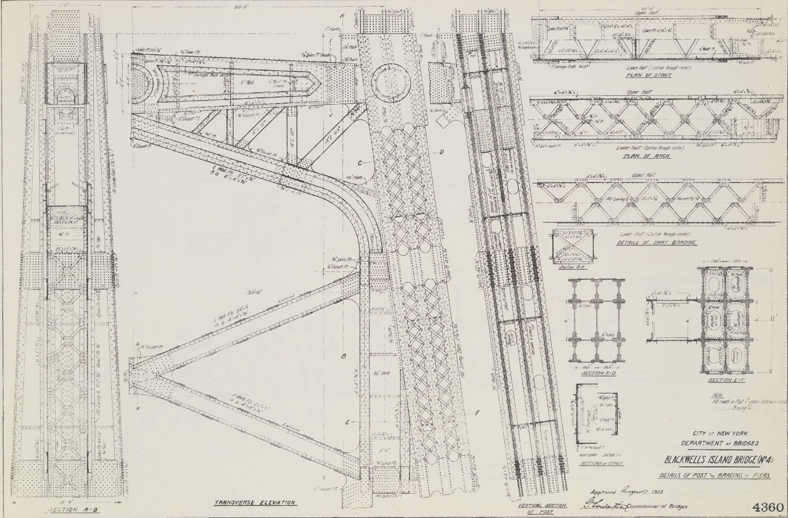

# Technical Drawings
Historical Engineering and Technical Drawings Resources

What is included:
- Historical documents with measured drawings

What is not included:
- Drawings made by/for hobby recreations and art
- Collections without scale/measurements
- Paywalled/non-digitized collections

## U.S. Library of Congress
Historic American Buildings Survey/Historic American Engineering Record/Historic American Landscapes Survey
https://www.loc.gov/pictures/collection/hh/

- Search for collections with "Measured Drawing(s)"
- Download TIFF for high resolution version

Example: [Texas State Capitol](https://www.loc.gov/pictures/search/?q=Drawing:%20tx0398&fi=number&op=PHRASE&va=exact&co%20=hh&st=gallery&sg%20=%20true)
(79 Drawings)

## U.S. National Archives

Series of Ship Engineering Drawings:
https://catalog.archives.gov/search-within/559623?availableOnline=true&typeOfMaterials=Architectural%20and%20Engineering%20Drawings

Example: [Plans for the Armored Cruiser USS Maine](https://catalog.archives.gov/id/53484484)
(571 Drawings)

## Deutsche Fotothek (German Photo Library)
Construction Drawings: https://www.deutschefotothek.de/gallery/freitext/Konstruktionszeichnungen

## New York City Department of Records
Interesting collections:
- Department of Buildings Architectural Plans and Drawings
- Parks and Parkways Drawings and Plans

https://nycma.lunaimaging.com/luna/servlet/view/all

## Denver Public Library Digital Collections
https://digital.denverlibrary.org/digital/search/order/datea/ad/asc/page/1

Example: [Denver & Rio Grande Railway Drawings](https://digital.denverlibrary.org/digital/collection/p16079coll29/search/searchterm/Denver%20and%20Rio%20Grande%20Railway%20Company./field/creato/mode/exact/conn/and)
(35 Drawings)

## Henry Ford Digital Collections
https://www.thehenryford.org/collections-and-research/digital-collections/search-results#advancedSearch=1&s.0.in=collectionTitle&s.0.for=Ford%20Motor%20Company%20Part%20Drawing%20Collection

Note: can use something like [dezoomify](https://dezoomify.ophir.dev/) to download the full res image after inspecting the page source

Example: [Ford Model A Drawings](https://www.thehenryford.org/collections-and-research/digital-collections/search-results#advancedSearch=1&tab=artifact-results&s.0.in=keywords&s.0.for=Technical%20drawings&s.1.in=keywords&s.1.for=Ford%20Model%20A%20automobile&years=0-0&f.type=documents&perPage=100&pageNum=1&sortBy=relevance)
(890 Drawings)

## San Francisco Maritime National Park Association

Booklet of General Plans Online:
https://maritime.org/doc/plans/index.php

Example: [USS Growler Submarine SSG577 Booklet of General Plans](https://maritime.org/doc/plans/ssg577.pdf)
(6 Drawings)

## Canada National Archives
Architectural and Technical Drawings:
https://recherche-collection-search.bac-lac.gc.ca/eng/Home/Search?DataSource=Archives&num=25&start=0&enviro=prod&TypeOfMaterialCode=700&OnlineCode=1

Example: [Canada Parliament Buildings](https://recherche-collection-search.bac-lac.gc.ca/eng/Home/Search?DataSource=Archives%7cFonAndCol&SearchIn_1=PartOfEn&SearchInText_1=180009&num=25&start=0&enviro=prod&OnlineCode=1)
(83 Drawings)

## Southern Methodist University Digital Collections
Railroad Engineering Drawings: https://digitalcollections.smu.edu/digital/collection/rwy/search/searchterm/Series%201:%20Engineering%20Drawings/field/series/mode/exact/conn/and

New York Bridge Drawings: https://digitalcollections.smu.edu/digital/collection/nam/search/searchterm/New%20York%20Bridge%20Drawings/field/part/mode/exact/conn/and

Example: [Queensboro Bridge](https://digitalcollections.smu.edu/digital/collection/nam/id/418/rec/22)
(200+ Drawings)

## Digital Public Library of America
Technical Drawings: https://dp.la/search?q=technical+drawings

## Science Museum Group UK
Hosts an online collection of select drawings from Railway Museum UK

Note: 
The website doesnt seem to be working for downloading the full res version of scans but there is a workaround. 
The collection utilizes the [IIIF Image API 2.0](https://iiif.io/api/image/2.0/) for access of large images, the URLs of which can be found using the museum's [Collections Online API](https://github.com/TheScienceMuseum/collectionsonline/wiki/Collections-Online-API)

- Use the Collections Online API to find the "zoom" URL of the drawing within the document you are viewing
- Replace the last part of the URL that says `.ptif` with `/full/full/0/default.tif`
    - This is essentially saying "give me the full image with no rotation and default colors in TIFF format"

Example: [North Eastern Railway and London & North Eastern Railway Carriage & Wagon Drawings](https://collection.sciencemuseumgroup.org.uk/documents/aa110131518/north-eastern-railway-and-london-north-eastern-railway-carriage-wagon-drawings)
(~100 Drawings)

- [Derby Carriage and Wagon Works](https://collection.sciencemuseumgroup.org.uk/documents/aa110002829/engineering-drawings-from-the-derby-carriage-and-wagon-works)
- [Jackson and Sharp Company Railway Car and Ship Plans Drawings](https://delaware.contentdm.oclc.org/digital/collection/p15323coll6/search/searchterm/Drawings)
